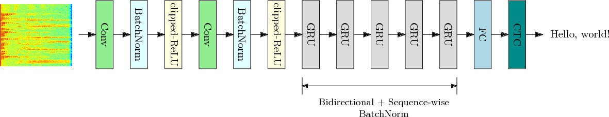
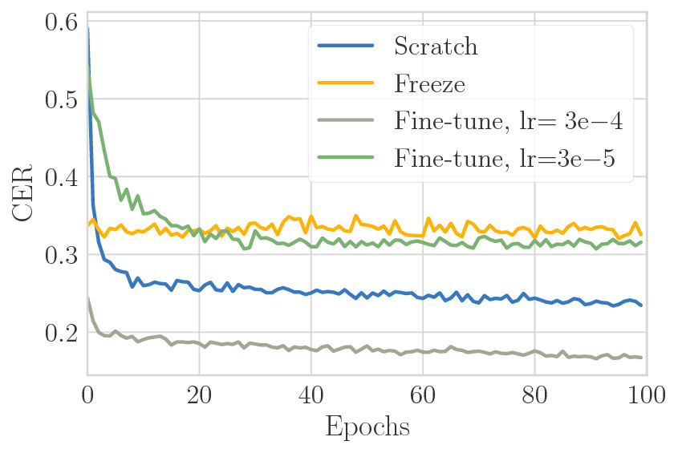

# A new automatic speech recognizer for Brazilian Portuguese based on deep neural networks and transfer learning

Pytorch code of "A new automatic speech recognizer for Brazilian Portuguese based on deep neural networks and transfer learning" submitted to AES-LAC 2018

**TL;DR**

The paper proposes how to perform transfer learning from a pre-trained model based on [Deep Speech 2](http://arxiv.org/pdf/1512.02595v1.pdf) for English to Brazilian Portuguese, outperforming previous work, achieving


## Abstract

This paper addresses the problem of training deep learning models for automatic speech recognition on languages with few resources available, such as Brazilian Portuguese, by employing transfer learning strategies. From a backbone model trained in English, the best fine-tuned network reduces the character error rate by 8.5%, outperforming previous works.



# Installation

Several libraries are needed to be installed for training to work. I will assume that everything is being installed in
an Anaconda installation on Ubuntu.

Install [PyTorch](https://github.com/pytorch/pytorch#installation) if you haven't already.

Clone this repo and run this within the repo:

```
pip install -r requirements.txt
```

Install this fork for Warp-CTC bindings:
```
git clone https://github.com/SeanNaren/warp-ctc.git
cd warp-ctc
mkdir build; cd build
cmake ..
make
export CUDA_HOME="/usr/local/cuda"
cd ../pytorch_binding
python setup.py install
```

Install pytorch audio:
```
sudo apt-get install sox libsox-dev libsox-fmt-all
git clone https://github.com/pytorch/audio.git
cd audio
python setup.py install
```

Install ignite:
```
git clone https://github.com/pytorch/ignite.git && \
cd ignite && \
python setup.py install && \
cd .. && \
rm -rf ignite
```

## Docker

Also, we provide a Dockerfile. See [here](docker/README.md) for how to setup correctly the docker.

# Usage

## Dataset

Five datasets were used in this paper. The Librispeech was used to train the backbone model, while the VoxForge PT-BR, Sid and Spoltech were used for fine-tune the pre-trained model to Brazilian Portuguese, and the LapsBM was used to performing the validation and test.

### Librispeech

To download and setup the Librispeech dataset run below command in the root folder of the repo:

```
python -m data.librispeech
```

Note that this dataset does not come with a validation dataset or test dataset.

### Voxforge

To download and setup the VoxForge dataset run below command in the root folder of the repo:

```bash
python -m data.voxforge
```

Note that this dataset does not come with a validation dataset or test dataset.

### Sid

To download and setup the Sid dataset run the below command in the root folder of the repo:

```bash
python -m data.sid
```

Note that this dataset does not come with a validation dataset or test dataset.

### Spoltech

The Spoltech dataset is not publicly available, so, you need to buy and download [here](https://catalog.ldc.upenn.edu/LDC2006S16). Then, you must extract into ```data/spoltech_dataset/downloads/extracted/files```. Finally run the below command in the root folder of the repo:

```bash
python -m data.spoltech
```

Note that this dataset does not come with a validation dataset or test dataset.

### LapsBM

To download and setup the LapsBM dataset run the below command in the root folder of the repo:

```bash
python -m data.lapsbm
```


### Custom Dataset

To create a custom dataset you must create a CSV file containing the locations of the training data. This has to be in the format of:

```txt
/path/to/audio.wav,/path/to/text.txt
/path/to/audio2.wav,/path/to/text2.txt
...
```

The first path is to the audio file, and the second path is to a text file containing the transcript on one line. This can then be used as stated below.

### Creating the PT-BR training manifest

The PT-BR training manifest is an ensemble of three minor datasets: VoxForge, Spoltech and Sid.

### Merging multiple manifest files

To create bigger manifest files (to train/test on multiple datasets at once) we can merge manifest files together like below from a directory containing all the manifests you want to merge. You can also prune short and long clips out of the new manifest.

```bash
cd data/
python merge_manifests.py --output-path pt_BR.train.csv sid.train.csv spoltech.train.csv voxforge.train.csv
```

## Training

The script [train.py](train.py) allows training the Deep Speech 2 model using a variety of hyperparameters and arbitrary datasets by using a configuration `.json` file as an input. You can check several examples in the [scripts][scripts/] folder.

Also, options like checkpoints and the localization of the results folder are inserted through the command-line. You may prompt

```bash
python train.py --help
```

or just check out [train.py](train.py) for more details.

### Checkpoints

Training supports saving checkpoints of the model to continue training from should an error occur or early termination. To enable epoch checkpoints use:

```
python train.py --checkpoint
```

To continue from a checkpointed model that has been saved:

```
python train.py --continue-from path/to/model.pth.tar
```

If you would like to start from a previous checkpoint model but not continue training, add the `--finetune` flag to restart training
from the `--continue-from` weights.

To also note, there is no final softmax layer on the model as when trained, warp-ctc does this softmax internally. This will have to also be implemented in complex decoders if anything is built on top of the model, so take this into consideration!

### Backbone model

To train the backbone model, we shall prompt

```bash
python train.py scripts/librispeech-from_scratch.json --data-dir data/ --train-manifest data/librispeech.train.csv --val-manifest data/librispeech.val.csv --local --checkpoint
```

and a folder called [result/librispeech-from_scratch] will be created containing the models checkpoint and the best model file. In the paper, our best backbone model achieved an word error rate (WER) of 11.66% and 30.70% on `test-clean` and `test-other` datasets.

### Fine-tuning with the same label set

The commands listed below are the experiments conducted in the Sec. 5.2 of the paper

#### From scratch

```bash
python train.py scripts/pt_BR-from_scratch.json --data-dir data/ --train-manifest data/pt_BR.train.csv --val-manifest data/lapsbm.val.csv --local --checkpoint
```

#### Freeze

```
python train.py scripts/pt_BR-finetune-freeze.json --data-dir data/ --train-manifest data/pt_BR.train.csv --val-manifest data/lapsbm.val.csv --continue-from results/librispeech-from_scratch/models/model_best-ckpt_5.pth --fintune --local --checkpoint
```

#### Fine-tune

with `lr=3e-4`
```bash
python train.py scripts/pt_BR-finetune.json --data-dir data/ --train-manifest data/pt_BR.train.csv --val-manifest data/lapsbm.val.csv --continue-from results/librispeech-from_scratch/models/model_best-ckpt_5.pth --fintune --local --checkpoint
```

with `lr=3e-5`
```bash
python train.py scripts/pt_BR-finetune-lower-lr.json --data-dir data/ --train-manifest data/pt_BR.train.csv --val-manifest data/lapsbm.val.csv --continue-from results/librispeech-from_scratch/models/model_best-ckpt_5.pth --finetune --local --checkpoint
```


#### Results

The results of these models in the [test set](data/lapsbm.test.csv) are listed below

<div style="width: 50%; marign: auto;">

|    |  [12]  | scratch | freeze | fine-tuning |
|----|--------|---------|--------|-------------|
 CER | 25.13% |  22.19% | 30.80% |   16.17%

 

</div>

### Fine-tuning with a broader label set

The commands listed below are the experiments conducted in the Sec. 5.3 of the paper

#### From sratch

```bash
python train.py scripts/pt_BR-from_scratch-accents.json --data-dir data/ --train-manifest data/pt_BR.train.csv --val-manifest data/lapsbm.val.csv --local --checkpoint
```

#### Random FC weights

```bash
python train.py scripts/pt_BR-finetune-accents-random-fc.json --data-dir data/ --train-manifest data/pt_BR.train.csv --val-manifest data/lapsbm.val.csv --continue-from results/librispeech-from_scratch/models/model_best-ckpt_5.pth --finetune --local --checkpoint
```


#### Non-random FC weights

```bash
python train.py scripts/pt_BR-finetune-accents-map-fc.json --data-dir data/ --train-manifest data/pt_BR.train.csv --val-manifest data/lapsbm.val.csv --continue-from results/librispeech-from_scratch/models/model_best-ckpt_5.pth --finetune --local --checkpoint
```

#### Results

|     | scratch | random FC weights | non-random FC weights |
|-----|---------|-------------------|-----------------------|
 CER  |  22.78% |       17.73%      |         17.72%        |

## Testing/Inference

To evaluate a trained model on a test set (has to be in the same format as the training set):

```
python test.py --model-path models/deepspeech.pth --test-manifest /path/to/test_manifest.csv --cuda
```

An example script to output a transcription has been provided:

```
python transcribe.py --model-path models/deepspeech.pth --audio-path /path/to/audio.wav
```

## Pre-trained models

Pre-trained models can be found under releases [here](https://github.com/SeanNaren/deepspeech.pytorch/releases).

## Citation

If you use this code in your research, please use the following BibTeX entry

```bibtex
@inproceedings{quintanilha2018,
author = {Quintanilha, I. M. and Biscainho, L. W. P. and Netto, S. L.},
title = "A new automatic speech recognizer for Brazilian Portuguese based on deep neural networks and transfer learning",
booktitle = "Congreso Latinoamericano de Ingenier\'{i}a de Audio",
address = {Montevideo, Uruguay},
month = {September},
year = {2018},
notes = {(Submitted)}
}
```

## Acknowledgements

This research was partially supported by CNPq and CAPES.

Thanks to [SeanNaren](https://github.com/SeanNaren) on whose implementation ours was inspired.

## References

[12] I. M. Quintanilha, End-to-end speech recognition
applied to Brazilian Portuguese using deep learning, M. Sc. dissertation, Universidade Federal do
Rio de Janeiro, Rio de Janeiro, Brazil (2017).